## Computer Vision Portfolio

*Author name: Simon Christiansen*
*Education IT-Technology, C++ Computer Vision*

## Table of contents

* Introduction
* Problem statements
	* Use case 1 - Simple shape recognition
	* Use case 2 - Document detection
	* Use case 3 - Face detection (Video)
* Methodology and process
	* Use case 1
	* Use case 2
	* Use case 3
* Results and final evaluation
	* Use case 1
	* Use case 2
	* Use case 3
* Appendix

## Introduction

## Problem statements
### Use case 1

With computer vision, is it possible to recognize simple shapes without Haar Cascade xml files. i.e. in production? How?

### Use case 2 - Document detection

When documents from images has to be used for postprocessing, i.e. OCR, is there a way to automate the process with Computer Vision and how?

### Use case 3 - Face detection

When processing images with persons, is it possible to do a simple face detection (NOT facial recognition), for use with profiles or costumer counting in stores? And is it possible to do it with a video, for other processes, i.e. auto crop, or simple face swap? 

## Methodology and process

### Use case 1

I chose to do a simple preprocessing by converting to grayscale, as we do not need the actual colors to estimate the shape of the figures.

As the test image is fairly simple without a lot of noise or distortion, the kernel for the Gaussian Blur was set to 1x1.  For images with more noise and contours, the process could benefit from a higher value.

For edge detection, Canny was used with a low threshold of 50 and a high of 150. This was sufficient as the image was simple. 

Canny result: 
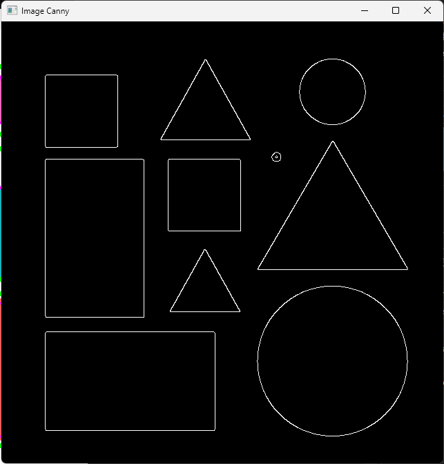{ style="display: block; margin: 0 auto" }

The Canny image was dilated with a kernel of 3x3 to close any possible gaps from the edge detection.

With the image dilated, it is fairly simple to get the contours of the shapes.

By using the dilated image with the CV contours and area function, we can see the size of the figures.
This is helpful when we want to filter out noise.

Printout: 
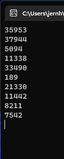

Here it is clear what noise Canny detected an edge on.

I simply filtered it out with a "if" statement.

By using the approxPolyDP algorithm, we can determine how many sides each polygon has.

Number of sides: 
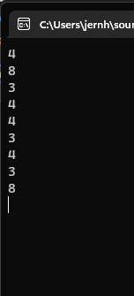

Defining the shape of the object can also be done with Haar Cascade, but this is kept less-simple.

Lastly, polygons with 3 sides are defined as triangles. Polygons with 4 sides are defined as squares or rectangles depending on their aspect ratio, and everything else as circles. This is simple done with if statements. Rectangles and text put on image.

Final result: 
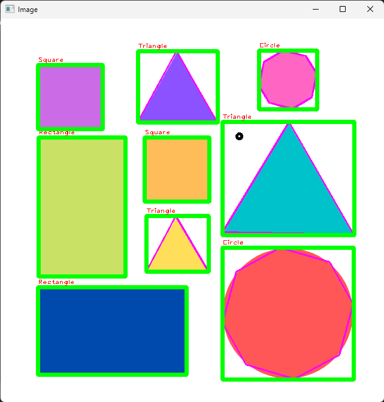

### Use case 2

I chose to do a simple preprocessing by converting to grayscale, and then blurring it with Gaussian Blur with a 3x3 kernel. I stated out with 3x3, and it proved to be enough for the small amount of test images. However, very large images has many more visible artifacts at gets tricky to process.

Before: 
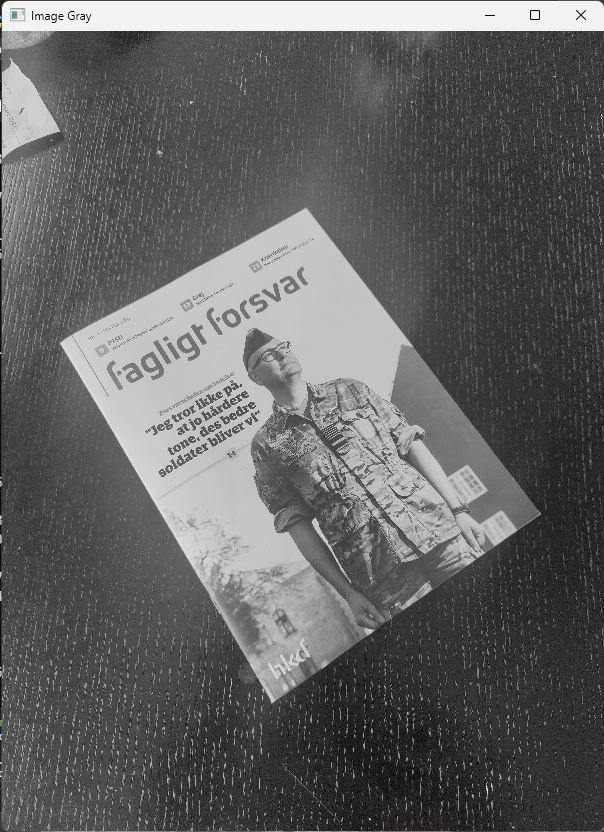

After: 

After I blurred the image, I used the Canny edge detection algorithm to detect the document/magazine.
I started out with a low threshold of 50 and a max of 150. I could have used trackbars, but the initial test with this threshold, turned out to be just perfect combined with the dilate algorithm to close possible open edges and corners. 

Canny: 
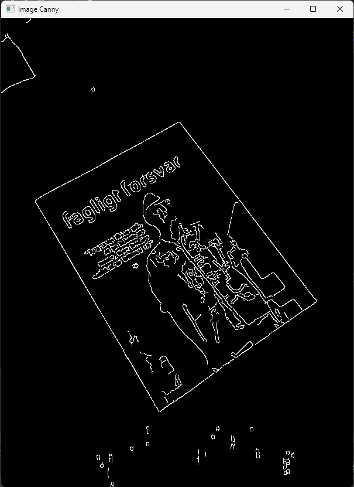

Canny dilated: 
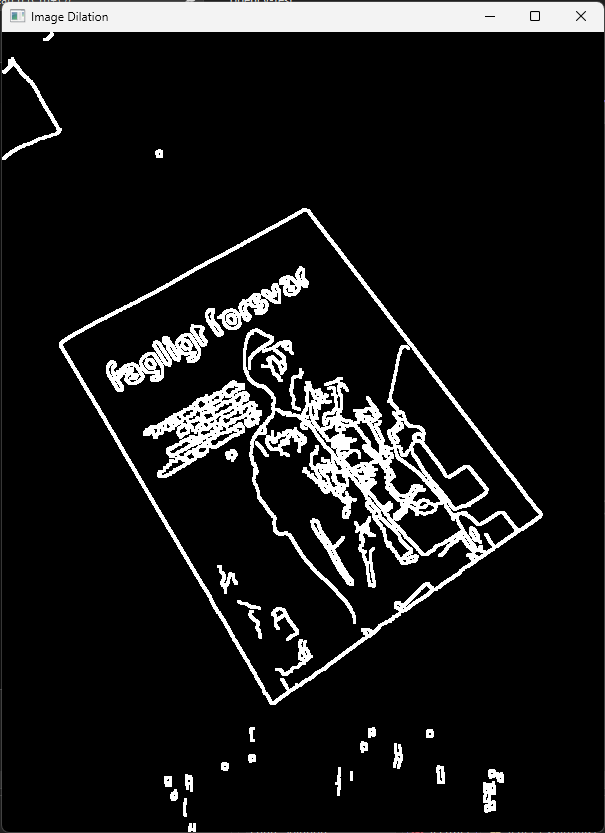
Next, I could extract the contour of the document/magazine by assuming it has the largest total contour area.
I printed the size of the areas in terminal.

Terminal: 
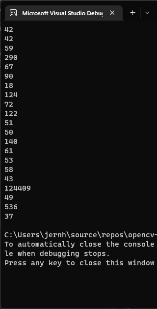

Based on the printout, I filtered out everything with more or less then 4 edges, and everything with an area below 50000 and drew a rectangle on it.

Result: 
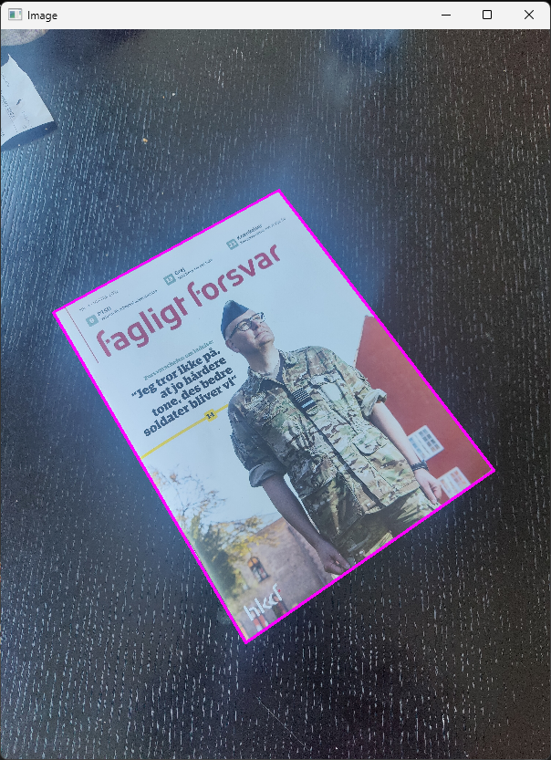

The vector points was then used as the source for the warp function. However, a small piece of code was necessary to ensure that the corner points was in the right order. Then a few pixels was cropped off to fix imperfect edges on the paper.

Warped and cropped final image: 
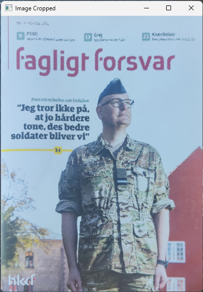

### Use case 3

With the use of CascadeClassifier object detection algorithm, and a pre-built xml file, it is extremally simple to do face detection. Face detection has NOTHING to do with facial recognition.

With the CascasdeClassifier tectMultiScale function and a few threshold values tweaked, it worked really well without any preprocessing (with the justdoit test video(greenscreen)) and a Ted talk clip.  But also works great on other front facing images and videos.

Still example: 
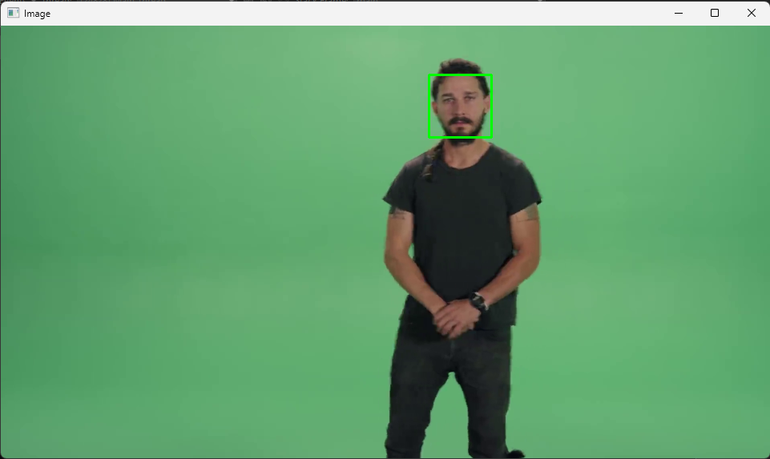

## Results and evaluation

### Use case 1

Determining simple shapes with low-noise images using very little preprocessing and noise filtering was successful. The number of shapes in this use case is limited, but can easily be expanded. 

### Use case 2 - Document detection

It was an extraordinary good result after a few minutes of tweaking, and very consistent. The process was fairly straight forward and very intuitive. It could easily be a preprocess for images with documents for OCR.

### Use case 3 - Face detection

It became clear how simple and easy it was to do simple face detection on images and videos. This is done with a front facing xml Haar Cascade file, but can easily be expanded to accommodate faces seen from different angels. 